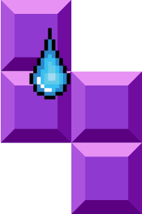

# Sweatris

Welcome to **Sweatris a Fitness-Themed Interactive Tetris Game**, a web-based application that combines physical activity and gaming for a fun, engaging workout experience. Using object detection and an intelligent algorithm for move recommendations, this project turns your movements into game controls, allowing you to play Tetris while staying active!

---

## Features

### 🎮 Gameplay
- Classic Tetris mechanics enhanced with move recommendation algorithms for smarter play.
- Real-time interactivity using your body movements to control the game.

### 📸 Object Detection
- Integrated live camera feed within the Streamlit app.
- Object detection powered by OpenCV and YOLO to track user movements and translate them into game actions.

### 🖥️ Architecture
- **Frontend**: Streamlit handles the interactive user interface and integrates the live video feed.
- **Backend**: PyGame runs the Tetris game logic, sending frame updates as JPEG-encoded strings to the frontend for display.

### 💪 Fitness Benefits
- Get a workout while playing your favorite game.
- Improve coordination and reflexes through dynamic movements.
- A fun alternative to traditional exercise routines.

---

## Usage

1. Open the Streamlit app in your browser.
2. Allow camera access.
3. Follow the on-screen instructions to start the game.
4. Move your body to control Tetris pieces and enjoy your workout!

## License

This project is licensed under the [MIT License](LICENSE).

